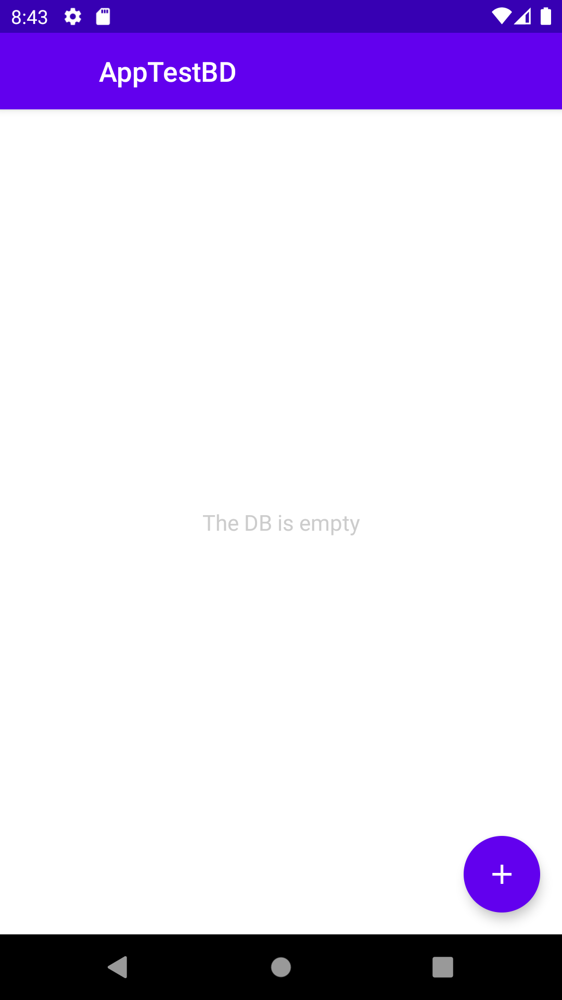
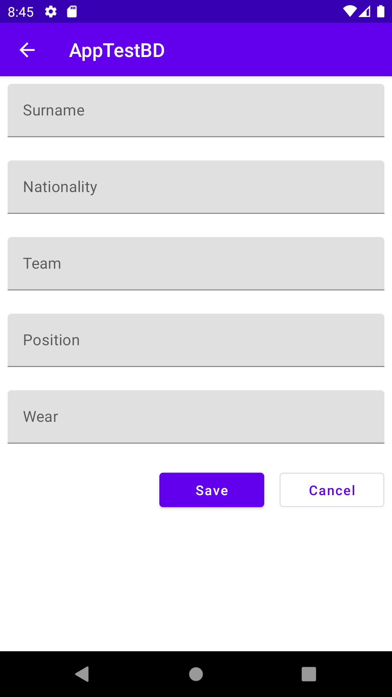

# Player DB
## App Android con Kotlin, Jetpack Compose, Navigation, Room, Dagger-Hilt

* [Jetpack Compose](https://developer.android.com/jetpack/compose)
* [Navigation](https://developer.android.com/jetpack/androidx/releases/navigation)
* [Room](https://developer.android.com/jetpack/androidx/releases/room)
* [Dagger-Hilt](https://dagger.dev/hilt)

## Funcionalidades de la App
* Crear, leer, modificar y borrar players
* Manejo boton atras

  
  

